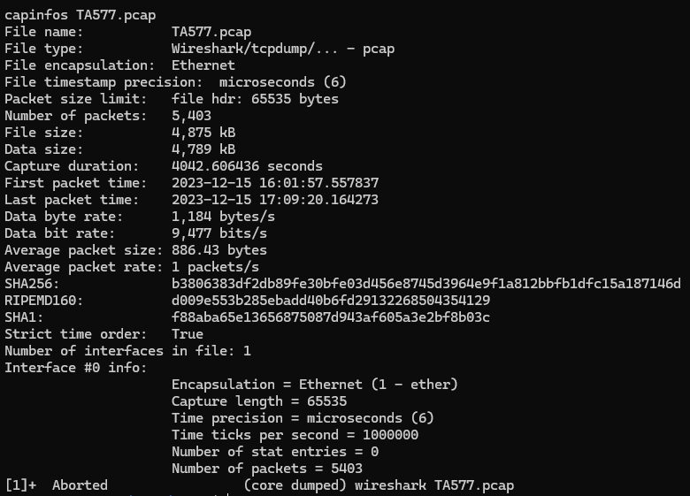
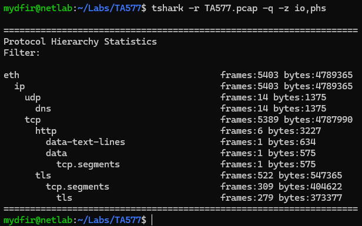
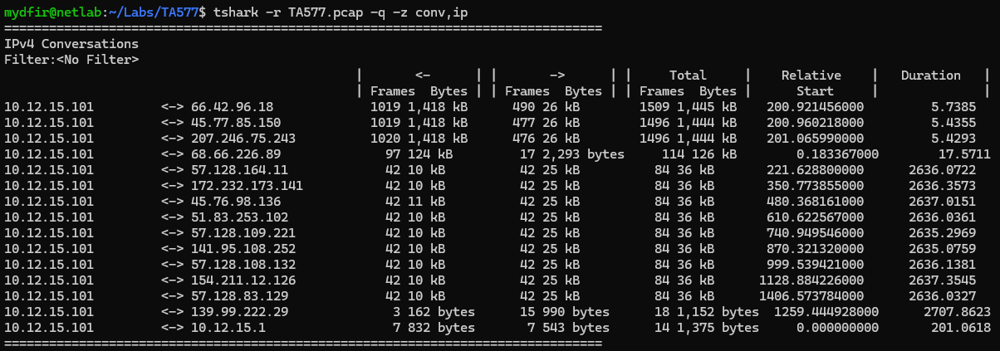
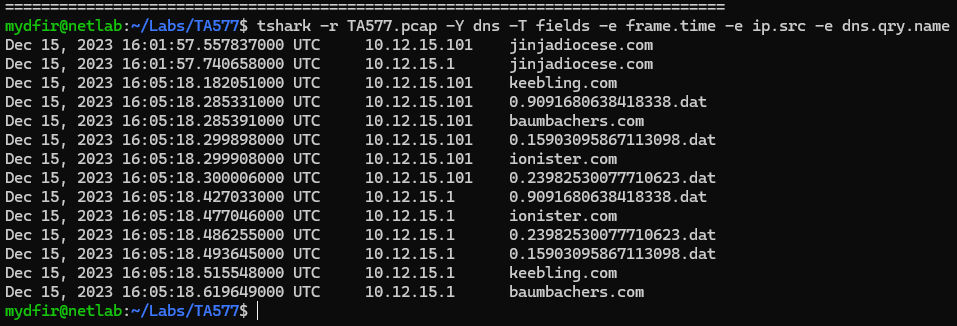
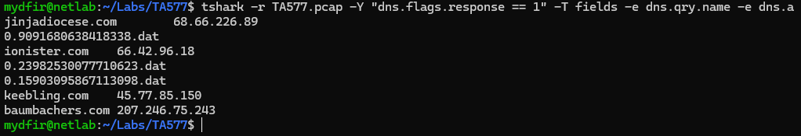
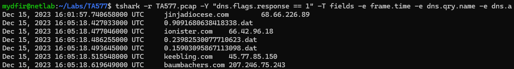
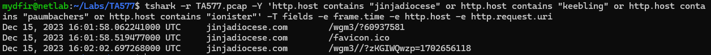
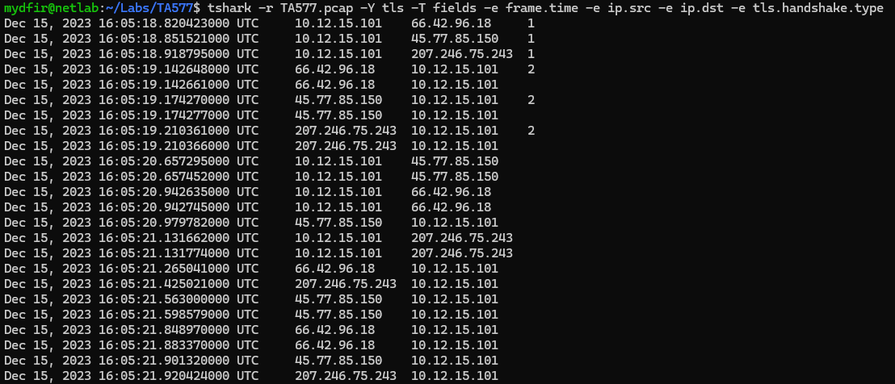
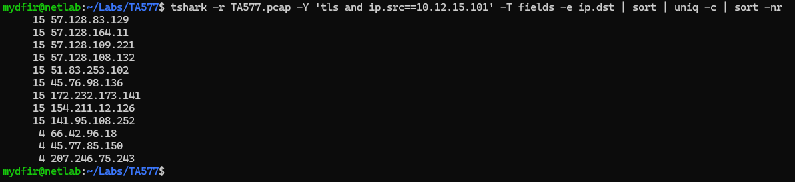
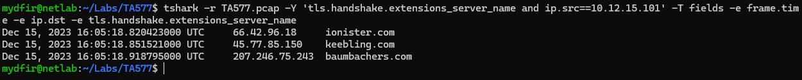

# TA577 PCAP Investigation Walkthrough

This walkthrough documents the **step-by-step analyst workflow** used to investigate suspected **TA577 activity** using only a packet capture (PCAP).  
The goal is to show **how conclusions were reached**, not just the final result.

---

## Step 1 — Investigation Preparation & PCAP Overview

Before analysis, the PCAP was validated to understand capture scope, timing, and integrity.

  
*Figure 1 – PCAP metadata showing capture duration, packet count, timestamps, and file hashes.*

This confirmed:
- Capture spans the reported incident timeframe
- No packet loss indicators
- Sufficient data for investigation

---

## Step 2 — Protocol Hierarchy Review

A protocol hierarchy review was performed to quickly identify dominant traffic types.

  
*Figure 2 – Protocol hierarchy showing significant TCP and TLS traffic.*

Key observations:
- TLS dominates the capture
- Limited HTTP traffic (suggesting initial access)
- DNS activity present prior to encrypted sessions

---

## Step 3 — Identify Top Talkers (Conversation Analysis)

IPv4 conversations were reviewed to identify the most active external communication.

  
*Figure 3 – IPv4 conversation statistics highlighting repeated communication between the victim host and external IPs.*

This revealed:
- Internal host `10.12.15.101` as the primary initiator
- Repeated communication with multiple external IPs

---

## Step 4 — DNS Query Analysis

DNS queries were examined to identify suspicious domain lookups.

  
*Figure 4 – DNS queries showing lookups for suspicious domains and unusual `.dat` entries.*

Red flags:
- Multiple suspicious domains queried in rapid succession
- Numeric `.dat` pseudo-domains (not normal DNS behavior)

---

## Step 5 — DNS Resolution (Domain → IP Mapping)

DNS responses were analyzed to map suspicious domains to IP addresses.

  
*Figure 5 – DNS responses resolving malicious domains to external IP addresses.*

This allowed correlation between:
- Domains
- Resolved IPs
- Subsequent network traffic

---

## Step 6 — DNS Pivot to Timeline Context

DNS resolution timing was correlated with the incident timeline.

  
*Figure 6 – DNS resolutions aligned with timestamps near the reported click event.*

This confirmed:
- DNS activity occurred immediately after the reported user action
- DNS preceded HTTP and TLS traffic

---

## Step 7 — HTTP Traffic Analysis (Initial Access)

HTTP requests were filtered to suspicious domains to identify initial access behavior.

  
*Figure 7 – HTTP GET requests to a malicious domain with suspicious URI parameters.*

Findings:
- Malicious domain accessed
- Randomized URI parameters
- Activity consistent with traffic broker infrastructure

---

## Step 8 — TLS Session Analysis

TLS traffic was reviewed to identify encrypted follow-on activity.

  
*Figure 8 – TLS handshake activity showing outbound encrypted connections from the victim host.*

Key indicators:
- TLS initiated by the internal host
- Multiple external destinations
- Encrypted communication following HTTP access

---

## Step 9 — Count Repeated TLS Connections

TLS destination IPs were counted to identify repeat communication patterns.

  
*Figure 9 – Frequency count showing multiple external IPs contacted exactly 15 times.*

This uniformity strongly suggests:
- Automation
- Beaconing behavior

---

## Step 10 — Beacon Timing Analysis

TLS Client Hello timestamps were analyzed to confirm periodic communication.

  
*Figure 10 – TLS Client Hello timestamps showing consistent ~22-minute intervals.*

This timing pattern is characteristic of **command-and-control beaconing** rather than user activity.

---

## Final Assessment

Based on:
- Phishing-based initial access
- Malicious ZIP delivery
- DNS, HTTP, and TLS correlation
- Periodic encrypted beaconing

We assess with **high confidence** that the host `10.12.15.101` was compromised and engaged in **TA577-associated command-and-control activity**.

---

## Analyst Takeaway

This investigation demonstrates how **network-only evidence** can be used to:
- Reconstruct attacker behavior
- Identify C2 beaconing
- Support confident incident conclusions without endpoint data
